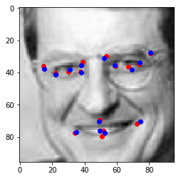
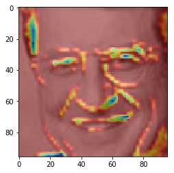

# Facial Keypoints Detection with feature visualization!

In this project , I have tried to work on Facial Landmarks Detection using Deep learning. Also I worked on using ***Grad-CAM*** feature visualization technique to confirm if the given layers are extracting exact features! Details are in the [blog](https://sezan92.github.io/2020/02/27/keypoint.html) 

